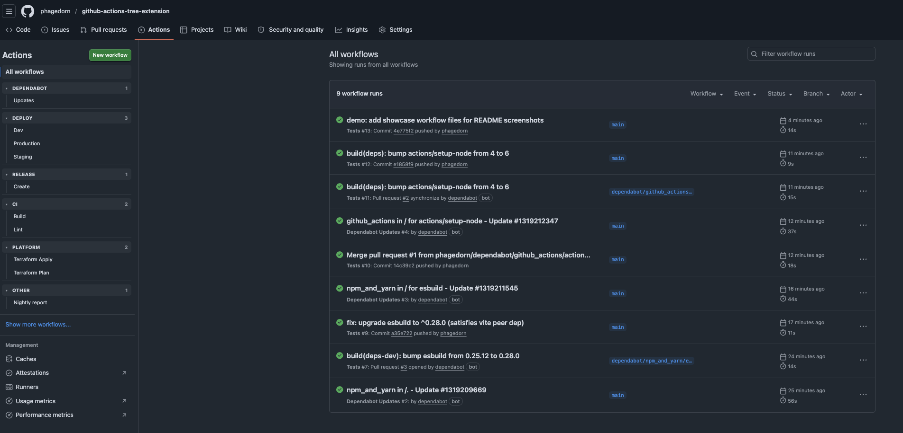
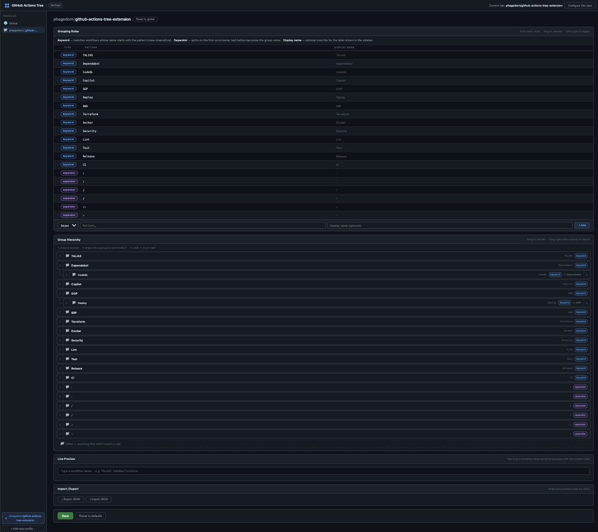

# GitHub Actions Workflow Tree

This Chrome extension turns the flat workflow list in the GitHub Actions left sidebar into a collapsible tree.

## How it works

Workflows are matched against an ordered list of rules. The first rule that matches determines the group the workflow appears in. Unmatched workflows fall into an **Other** group at the bottom.

There are two rule types:

| Type | How it matches | Example pattern | Example workflow name | Result |
|---|---|---|---|---|
| **keyword** | Name *starts with* the pattern (case-insensitive) | `Deploy` | `Deploy production` | group **Deploy**, label `production` |
| **separator** | Name *contains* the pattern; text before = group | ` / ` | `Platform / Terraform Plan` | group **Platform**, label `Terraform Plan` |

## Quick example

Workflows named like:

```
Platform / Terraform Plan
Platform / Terraform Apply
Security / CodeQL
Security / Dependency Scan
```

appear in the sidebar as:

```
▾ Platform
    Terraform Plan
    Terraform Apply
▾ Security
    CodeQL
    Dependency Scan
```



## Install
1. Download and unzip the extension.
2. Open `chrome://extensions`.
3. Enable **Developer mode**.
4. Click **Load unpacked**.
5. Select the unzipped folder.

## Settings page

Open the settings page via the extension's **Details → Extension options** link in `chrome://extensions`, or click the gear icon that appears in the sidebar on GitHub.



### Profiles

The settings page uses a two-panel layout. The left sidebar lists your **profiles**:

- **Global** (🌐) — the default rules used on every repo unless overridden.
- **Per-repo profiles** (📁) — rules that apply only when you are browsing that specific `owner/repo`. When a repo profile exists it completely replaces the global rules for that repo.

#### Adding a repo profile

Click **+ Add current repo** at the bottom of the sidebar while you have a GitHub repo tab open. The button shows the `org/repo` name it detected. After adding, the profile starts by **inheriting** the global rules (read-only preview). Click **Customise** to create an independent copy you can edit.

#### Resetting a repo profile

Click **Reset to global** inside a repo profile to delete its custom rules and go back to inheriting the global rules.

#### Deleting a profile

Click the **×** button next to the profile name in the sidebar.

---

### Rules table

The main panel shows the rules for the selected profile as a table. Each row is one rule:

| Column | Description |
|---|---|
| ⠿ (drag handle) | Drag a row up or down to change its priority. **First match wins**, so order matters. |
| Type badge | **keyword** (blue) or **separator** (purple). Click the badge to toggle between the two types. |
| Pattern | The text to match against the workflow name. Case-insensitive for keyword rules. |
| Display name | Optional. If set, this label is shown as the group heading instead of the matched pattern. Leave blank to use the pattern itself. |
| × | Remove the rule. |

#### Adding a rule

Fill in **Pattern** and optionally **Display name** at the bottom of the table, choose a type, and click **Add**.

#### Import / Export

- **Export** downloads the current profile's rules as a JSON file.
- **Import** loads rules from a previously exported file, replacing the current profile's rules.

---

### Group Hierarchy

The **Group Hierarchy** card at the bottom of the settings page shows a live preview of how your rules create groups. Groups are listed in match order with an **Other** entry always at the end.

You can drag rows in this card to reorder groups (equivalent to reordering the underlying rules). Drop a row onto the **middle third** of another row to make it a **subgroup** — it will be indented under its parent in the sidebar. Click the **←** unindent button to promote a subgroup back to the top level.

---

### Live preview

Type any workflow name into the **Preview** box to instantly see which group and label it would resolve to, and which rule matched.

---

## Notes
- No GitHub API calls — everything runs client-side.
- Works on github.com and GitHub Enterprise instances.
- Rules are stored in `chrome.storage.sync` and sync across your Chrome profile.
- If GitHub changes the sidebar DOM, the extension's selectors may need a small update.

## Changelog

### 1.2.0
- Configurable grouping rules with keyword and separator types
- Per-repo profiles with global fallback
- Full settings page with drag-to-reorder rules and group hierarchy editor
- Live preview of rule matching

### 1.0.1
- Prevents duplicate rendering
- Hides the original workflow rows more reliably
- Ignores links rendered by the extension itself
